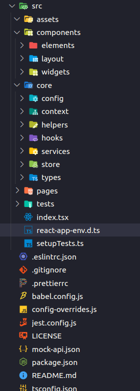

# ReactJS base project with Typescript
### [Typescript/ReactJS] - Base project to ReactJS for when you'll need start a new project you've all tools installed and configured.

## Tools/Packages and Modules Installed and Configured

<ul>
  <li>React Query - V3</li>
  <li>Material UI - V5</li>
  <li>React Redux - Redux Toolkit</li>
  <li>Styled Components</li>
  <li>React Hook Form</li>
  <li>Axios</li>
  <li>Yup</li>
  <li>Jest</li>
  <li>EsLint and Prettier</li>
</ul>

## Structure of folders

 

### My  <a href="https://www.slideshare.net/RubenMarcusLuzPascho/escalando-apps-com-react-e-type-script-e-solid" target="_blank">reference</a> slides of Ruben Marcus
